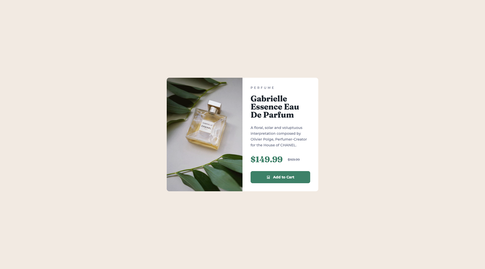

# Frontend Mentor - Product preview card component solution

This is a solution to the [Product preview card component challenge on Frontend Mentor](https://www.frontendmentor.io/challenges/product-preview-card-component-GO7UmttRfa).

## Table of contents

- [Overview](#overview)
  - [The challenge](#the-challenge)
  - [Screenshot](#screenshot)
  - [Links](#links)
- [My process](#my-process)
  - [Built with](#built-with)
- [Author](#author)

## Overview

### The challenge

To build out this product preview card component and get it looking as close to the design as possible.

Users should be able to:

- View the optimal layout depending on their device's screen size
- See hover and focus states for interactive elements

### Screenshot

### Links

- Live Site URL: [Go to live page](https://antoru-preview-card-component.netlify.app/)

## My process

### Built with

- Semantic HTML5 markup
- CSS custom properties
- Flexbox
- Mobile-first workflow
- [Sass](https://sass-lang.com/) - For styles

### Deploying the project

Project hosted for free, thanks to:

- [Netlify](https://www.netlify.com/)

## Author

- Linkedin - [https://www.linkedin.com/in/antoru/](https://www.linkedin.com/in/antoru/)
- Frontend Mentor - [https://www.frontendmentor.io/profile/antoru](https://www.frontendmentor.io/profile/antoru)